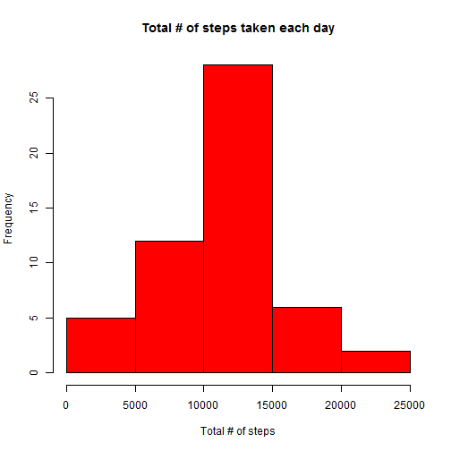
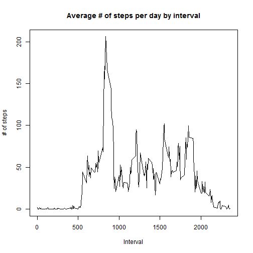
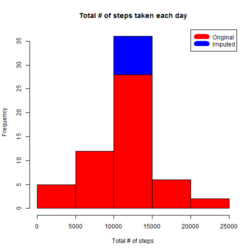
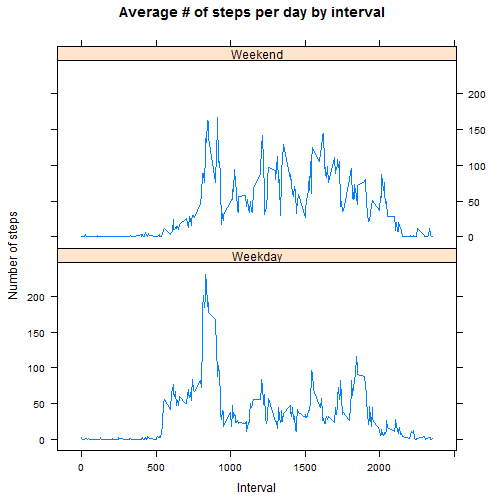

RR Assignment 1
===============
Created by: ipsprabhu

### Information about Data

The variables included in this dataset are:

- steps: Number of steps taking in a 5-minute interval (missing values are coded as NA)
- date: The date on which the measurement was taken in YYYY-MM-DD format
- interval: Identifier for the 5-minute interval in which measurement was taken

### Set the global parameter

```r
library(knitr)
opts_chunk$set(echo=TRUE)
```

### Loading and processing the data.

Read the .csv file into a data frame called data

```r
setwd("C:/Work/RR")
data<- read.csv("activity.csv")
```

### What is mean total number of steps taken per day?

Using the ddply function in plyr package, sum the number of steps taken for each day.

```r
library(plyr)
steps_day<- ddply(data, .(date), summarize, totalsteps = sum(steps))
hist(na.omit(steps_day$totalsteps),main="Total # of steps taken each day",
     xlab="Total # of steps",ylab="Frequency",col="Red")
```

 

```r
steps_mean<- mean(steps_day$totalsteps,na.rm=TRUE)
steps_median<- median(steps_day$totalsteps,na.rm=TRUE)
```
The mean of total number of steps taken per day is 1.0766189 &times; 10<sup>4</sup> and the median of the total number of steps taken per day is 10765.

### What is the average daily activity pattern?

Using the ddply function in plyr package, get the average number of steps taken for each interval across all days.

```r
library(plyr)
act_patt<- ddply(data, .(interval), summarize, totalsteps = mean(na.omit(steps)))
plot(act_patt$interval,act_patt$totalsteps,type="l",main="Average # of steps per day by interval",xlab="Interval",ylab="# of steps")
```

 

```r
max_step<- act_patt$interval[which.max(act_patt$totalsteps)]
```
The 5-minute interval that contains maximum # of steps is 835.

### Imputing missing values

Using replace function substitute the mean of 5-minute interval across all days for NA values.


```r
new_data<- data
new_data$steps<- replace(new_data$steps,is.na(new_data$steps),
                         act_patt$totalsteps[match(act_patt$interval,
                                                   new_data$interval)])
new_steps_day<- ddply(new_data, .(date), summarize, totalsteps = sum(steps))
hist(na.omit(new_steps_day$totalsteps),main="Total # of steps taken each day",
     xlab="Total # of steps",ylab="Frequency",col="Blue")
hist(na.omit(steps_day$totalsteps),col="Red",add=TRUE)
legend("topright",col=c("red", "blue"), lty=1, lwd=10,  
         c("Original", "Imputed"))
```

 

```r
i_steps_mean<- mean(new_steps_day$totalsteps)
i_steps_median<- median(new_steps_day$totalsteps)
```
The imputed mean of total number of steps taken per day is 1.0766189 &times; 10<sup>4</sup> and the imputed median of the total number of steps taken per day is 1.0766189 &times; 10<sup>4</sup>.

The mean and median has become the same due to imputing the mean of 5-minute interval across all days for NA values.

### Are there differences in activity patterns between weekdays and weekends?
- Using the weekdays() find out the day of the week.
- Using the recode function from car package replace Saturday and Sunday with 'Weekend'. Replace the other days with 'Weekday'.
- Using the ddply function in plyr package, get the average number of steps taken for each interval across weekday and weekend.

```r
library(car)
library(lattice)
new_data$day<- weekdays(as.Date(new_data$date))
new_data$day<- recode(new_data$day,'c("Sunday","Saturday") = "Weekend";
               c("Monday","Tuesday","Wednesday","Thursday","Friday")="Weekday"')
week_patt<- ddply(new_data, .(interval,day), summarize, 
                  totalsteps = mean(steps))
xyplot(totalsteps ~ interval|day,data = week_patt,layout=c(1,2),type="l",
       main="Average # of steps per day by interval",xlab="Interval",
       ylab="Number of steps")
```

 
